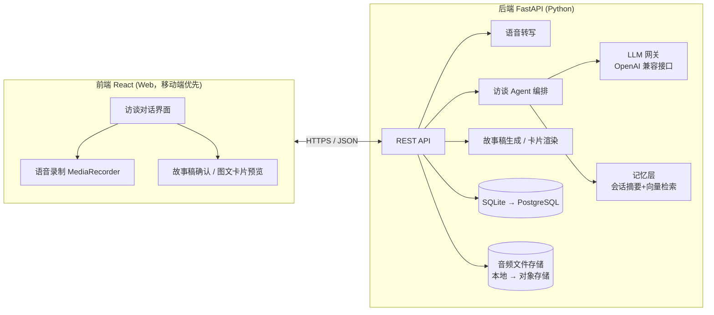

# 技术文档 · life-agent

> 版本 v0.1 · 2026-07-27 · 配合 [PRD.md](PRD.md) 阅读
> 本文档是活文档：技术决策变了就改这里，并在文末「变更记录」追加一行。

## 1. 总体架构



分层原则：**前端只管交互，所有智能都在后端**。LLM、提示词、记忆逻辑不进前端，方便日后换模型、加小程序端。

## 2. 前端

| 项 | 选型 | 理由 |
|---|---|---|
| 框架 | React 18 + Vite + TypeScript | 已有 React 经验，Vite 起步快 |
| UI | TailwindCSS（可加 shadcn/ui） | 移动端优先的对话界面，不需要重组件库 |
| 状态 | Zustand | 轻，够用；对话流状态简单 |
| 路由 | React Router | 页面少：访谈页 / 故事稿页 / 我的故事列表 |
| 语音录制 | 浏览器 MediaRecorder API | 录音上传后端转写；**原始音频必须保留**（P2 视频要用原声） |
| 请求 | fetch + SSE | 对话回复用 SSE 流式输出，体感快 |

页面（MVP 只有 3 个）：
1. **访谈页**：对话流 + 按住说话/文字输入，agent 追问逐条流式出现
2. **故事稿页**：生成的第一人称故事稿，行内可编辑，确认按钮
3. **我的故事**：历史故事列表（默认私密）

## 3. 后端

| 项 | 选型 | 理由 |
|---|---|---|
| 框架 | FastAPI (Python 3.11+) | AI 生态都在 Python；conda 环境 `ai_agent` 已就绪 |
| ORM | SQLModel | FastAPI 亲和，Pydantic 一套模型走天下 |
| 数据库 | SQLite（MVP）→ PostgreSQL | MVP 零运维；表结构设计时避免 SQLite 专属特性 |
| 向量检索 | 先不建独立向量库：MVP 用 LLM 直接读会话摘要；跨会话记忆需求成立后再上 Chroma/pgvector | 不为还没发生的规模引入组件 |
| 音频存储 | 本地 `data/audio/`（MVP）→ 对象存储 | 同上 |
| LLM 接入 | **OpenAI 兼容网关层**，模型可配置 | 不锁死供应商；对话/生成可用不同模型 |
| ASR | 可配置：本地 faster-whisper（免费、隐私好）或云 API | 中文口语转写质量以实测为准，先本地跑通 |

### 3.1 LLM 网关

统一走 OpenAI 兼容接口（`base_url` + `api_key` + `model` 三个环境变量即可切换），候选：

- 对话（访谈追问）：需要低延迟 + 好的中文口语理解 —— DeepSeek / Qwen / Claude 任一，实测定
- 生成（故事稿）：需要最强的中文叙事能力 —— 这一步值得用最好的模型，量小成本可控

### 3.2 核心资产：提示词体系（`prompts/` 目录，版本化管理）

```
prompts/
  interviewer.md      # 采访者人格：不评判、先复述后追问、一次一个问题
  probe_strategies.md # 追细节策略：追原话/追具象/追第一反应
  story_arc.md        # 故事弧线模板：铺垫→转折→情绪落点
  safety.md           # 危机信号识别与转介话术（上线前提）
```

提示词改动等同于代码改动：走 git 提交，commit message 说明调优原因和效果。

### 3.3 API 草案

```
POST /api/sessions                  # 开启一次访谈
POST /api/sessions/{id}/messages    # 发消息（文字或音频），SSE 返回 agent 回复
POST /api/sessions/{id}/story       # 从访谈生成故事稿
PATCH /api/stories/{id}             # 用户修改/确认故事稿
GET  /api/stories                   # 我的故事列表
POST /api/stories/{id}/card         # 生成图文卡片（返回图片）
```

### 3.4 数据模型草案

```
User(id, nickname, created_at)
Session(id, user_id, status, summary, created_at)          # 一次访谈
Message(id, session_id, role, text, audio_path, created_at) # audio_path 保留原声
Story(id, session_id, draft_md, final_md, status[draft/confirmed/published], created_at)
```

## 4. 图文卡片渲染

故事稿(markdown) → HTML 模板 → **后端 Playwright 截图**出长图。理由：字体/排版服务端可控，前端 html2canvas 的字体与跨端一致性坑多。模板先做 1 套，好看优先于多样。

## 5. 安全与隐私（对应 PRD 底线）

- 所有接口默认鉴权后仅返回本人数据；故事默认 `draft/confirmed`，`published` 必须显式操作
- 音频与故事内容不进任何第三方日志；调用 LLM 时按供应商政策确认不用于训练
- `safety.md` 危机识别规则在访谈 agent 的每轮回复前置检查，命中则转介热线资源
- 秘钥全部走 `.env`（已在 .gitignore），仓库只放 `.env.example`

## 6. 部署（MVP 从简)

- 开发：前端 `vite dev` + 后端 `uvicorn --reload`，前端代理 `/api`
- 小范围测试：单台服务器 docker-compose（frontend nginx + backend + volume）
- 不做 CI/CD、不做 k8s，用户量说话

## 7. 目录结构规划

```
life-agent/
  docs/           # PRD / TECH / TASKS，活文档
  prompts/        # 提示词（核心资产，版本化）
  backend/
    app/          # FastAPI: routers / services / models
    data/         # SQLite + 音频（gitignore）
  frontend/
    src/          # React
```

## 8. 变更记录

| 日期 | 变更 | 原因 |
|---|---|---|
| 2026-07-27 | v0.1 初稿 | 技术路线定稿：React + FastAPI + OpenAI 兼容 LLM 网关 |
