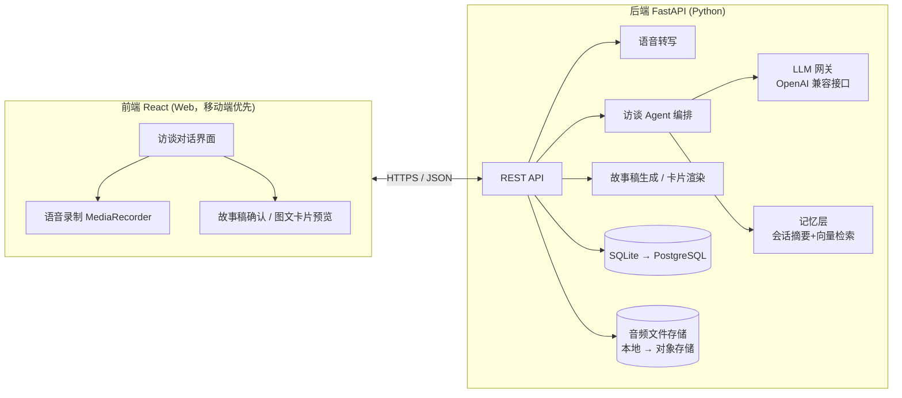

# 技术文档 · life-agent

> 版本 v0.1 · 2026-07-27 · 配合 [PRD.md](PRD.md) 阅读
> 本文档是活文档：技术决策变了就改这里，并在文末「变更记录」追加一行。

## 1. 总体架构



分层原则：**前端只管交互，所有智能都在后端**。LLM、提示词、记忆逻辑不进前端，方便日后换模型、加小程序端。

## 2. 前端

| 项 | 选型 | 理由 |
|---|---|---|
| 框架 | React 18 + Vite + TypeScript | 已有 React 经验，Vite 起步快 |
| UI | TailwindCSS（可加 shadcn/ui） | 移动端优先的对话界面，不需要重组件库 |
| 状态 | Zustand | 轻，够用；对话流状态简单 |
| 路由 | React Router | 页面少：访谈页 / 故事稿页 / 我的故事列表 |
| 语音录制 | 浏览器 MediaRecorder API | 录音上传后端转写；**原始音频必须保留**（P2 视频要用原声） |
| 请求 | fetch + SSE | 对话回复用 SSE 流式输出，体感快 |

页面（MVP 只有 3 个）：
1. **访谈页**：对话流 + 按住说话/文字输入，agent 追问逐条流式出现
2. **故事稿页**：生成的第一人称故事稿，行内可编辑，确认按钮
3. **我的故事**：历史故事列表（默认私密）

## 3. 后端

| 项 | 选型 | 理由 |
|---|---|---|
| 框架 | FastAPI (Python 3.11+) | AI 生态都在 Python；conda 环境 `ai_agent` 已就绪 |
| ORM | SQLModel | FastAPI 亲和，Pydantic 一套模型走天下 |
| 数据库 | SQLite（MVP）→ PostgreSQL | MVP 零运维；表结构设计时避免 SQLite 专属特性 |
| 向量检索 | 先不建独立向量库：MVP 用 LLM 直接读会话摘要；跨会话记忆需求成立后再上 Chroma/pgvector | 不为还没发生的规模引入组件 |
| 音频存储 | 本地 `data/audio/`（MVP）→ 对象存储 | 同上 |
| LLM 接入 | **OpenAI 兼容网关层**，模型可配置 | 不锁死供应商；对话/生成可用不同模型 |
| ASR | 可配置：本地 faster-whisper（免费、隐私好）或云 API | 中文口语转写质量以实测为准，先本地跑通 |

### 3.1 LLM 网关

统一走 OpenAI 兼容接口（`base_url` + `api_key` + `model` 三个环境变量即可切换），候选：

- 对话（访谈追问）：需要低延迟 + 好的中文口语理解 —— DeepSeek / Qwen / Claude 任一，实测定
- 生成（故事稿）：需要最强的中文叙事能力 —— 这一步值得用最好的模型，量小成本可控

### 3.2 核心资产：提示词体系（`prompts/` 目录，版本化管理）

```
prompts/
  interviewer.md      # 采访者人格：不评判、先复述后追问、一次一个问题
  probe_strategies.md # 追细节策略：追原话/追具象/追第一反应
  story_arc.md        # 故事弧线模板：铺垫→转折→情绪落点
  safety.md           # 危机信号识别与转介话术（上线前提）
```

提示词改动等同于代码改动：走 git 提交，commit message 说明调优原因和效果。

### 3.3 API 草案

```
POST /api/sessions                  # 开启一次访谈
POST /api/sessions/{id}/messages    # 发消息（文字或音频），SSE 返回 agent 回复
POST /api/sessions/{id}/story       # 从访谈生成故事稿
PATCH /api/stories/{id}             # 用户修改/确认故事稿
GET  /api/stories                   # 我的故事列表
POST /api/stories/{id}/card         # 生成图文卡片（返回图片）
```

### 3.4 数据模型草案

```
User(id, nickname, created_at)
Session(id, user_id, status, summary, created_at)          # 一次访谈
Message(id, session_id, role, text, audio_path, created_at) # audio_path 保留原声
Story(id, session_id, draft_md, final_md, status[draft/confirmed/published], created_at)
```

### 3.5 访谈 Agent 设计（核心）

> 设计依据：《AI Agents in Depth》的几条工程结论——Agent = LLM + 上下文 + 工具；编排从简（单次调用 → 工作流 → 自主 Agent）；Harness 的价值在约束/验证/纠正；状态栏用代码维护、读数与操作策略成对给出；KV Cache 友好的上下文结构。

#### 3.5.1 编排模式：外层工作流 + 节点内自主

访谈流程是**代码写死的阶段状态机**，LLM 只在节点内部自主提问。理由：流程控制严格（不会还没破冰就追问隐私）、攻击面小、可测试；访谈本身步骤可预测，不需要开放式 ReAct 循环。

```
warmup(破冰) → explore(找线索) → deepen(追细节,可循环) → emotion(情绪落点) → wrapup(复述确认收尾) → draft(生成故事稿)
```

阶段推进条件由**代码判定**（轮次、细节密度计数），不依赖 LLM 自我感觉——防"过早宣布完成"。

#### 3.5.2 访谈状态栏（代码维护，不用 LLM 维护）

每轮调用前，Harness 用代码计算状态、以 user 角色消息追加到轨迹**末尾**（`<agent_status>` 标签包裹），给模型"仪表盘"而不是让它从长历史里现数：

```yaml
stage: deepen            # 当前阶段
turns: 14/40             # 轮次预算
leads: [辞职那天, 母亲的电话]   # 已发现的故事线索
current_lead: 母亲的电话
detail_hits: {原话: 2, 具象: 1, 第一反应: 0}   # 细节密度计数
emotion_signals: [沉默较长, 提到"后悔"]
```

关键经验（书中量化结论）：**读数必须配操作策略**，光给数字模型不会用。状态栏后紧跟一句策略，如"第一反应还没挖到，本阶段至少各命中 1 次才可进入 emotion；轮次过半仍无新线索则收束到 current_lead"。

#### 3.5.3 KV Cache 友好的上下文结构

```
[系统提示词(interviewer人格，静态)] → [轨迹: 对话历史] → [<agent_status> 状态栏(末尾追加)]
```

- 系统提示词和（未来的）工具定义**一旦确定不改**；时间戳、阶段等动态信息永远尾部追加，绝不进系统提示词
- 状态栏用"每轮替换"策略（访谈轨迹短，末尾失效代价低，换上下文整洁）
- 严格使用标准 messages 角色格式，不自行拼接文本

#### 3.5.4 防编造：故事稿的 grounding 校验（proposer-reviewer）

故事稿最大的风险是 LLM 替用户**编造细节**——这会瞬间摧毁"被懂"的信任。采用提议者-审核者模式：

1. 生成者按 `story_arc.md` 产出故事稿
2. 审核者对照访谈原文逐条核查：每个具体细节（原话/场景/时间/人物）必须能溯源到访谈记录，查出虚构则打回重写
3. 由校验决定完成，而不是生成者的自我感觉

#### 3.5.5 危机检测（输入侧分层防御）

每轮用户消息先过两层：① 代码层关键词规则（零成本、零延迟、兜底）；② 命中可疑信号时 LLM 分类确认。确认后 agent 切换到 `safety.md` 话术并给出求助资源，暂停访谈流程。检查在 Harness 层执行，不依赖提示词自觉。

#### 3.5.6 记忆分层

| 层 | 存在哪 | 内容 |
|---|---|---|
| 轨迹 | Message 表 | 一次访谈的完整历史，append-only |
| 业务状态 | Session.state (JSON) | 阶段机状态、状态栏字段——事件驱动恢复的依据 |
| 用户长期记忆 | 后置（P1 后） | 跨会话摘要（"上次聊到辞职的事"），先用 Enhanced Notes 级别 |

#### 3.5.7 评估（轻量but必须有）

提示词改动无评估等于盲调。P0 配一个最小评估环：**LLM 扮演 3~5 个受访者 persona**（表达能力差/防御心重/话痨跑题）与 interviewer 自动对话 → LLM-as-judge 按检查项打分（细节密度、是否说教、是否一次多问、故事稿可溯源率）。提示词调优前后跑同一组 persona 对比，结果记入 TASKS 决策日志。

#### 3.5.8 语音策略：按住说话，绕开 VAD

MVP 用 **push-to-talk（按住说话）**，松手即端点——把"用户说完没有"这个语音交互中最难的问题（VAD 静音阈值/轮次判断）整个绕开，零成本得到准确端点。级联管线 ASR→LLM，原始音频必须落盘（P2 视频的原声素材）。流式化、自动断句留到 P2 再考虑。

## 4. 图文卡片渲染

故事稿(markdown) → HTML 模板 → **后端 Playwright 截图**出长图。理由：字体/排版服务端可控，前端 html2canvas 的字体与跨端一致性坑多。模板先做 1 套，好看优先于多样。

## 5. 安全与隐私（对应 PRD 底线）

- 所有接口默认鉴权后仅返回本人数据；故事默认 `draft/confirmed`，`published` 必须显式操作
- 音频与故事内容不进任何第三方日志；调用 LLM 时按供应商政策确认不用于训练
- `safety.md` 危机识别规则在访谈 agent 的每轮回复前置检查，命中则转介热线资源
- 秘钥全部走 `.env`（已在 .gitignore），仓库只放 `.env.example`

## 6. 部署（MVP 从简)

- 开发：前端 `vite dev` + 后端 `uvicorn --reload`，前端代理 `/api`
- 小范围测试：单台服务器 docker-compose（frontend nginx + backend + volume）
- 不做 CI/CD、不做 k8s，用户量说话

## 7. 目录结构规划

```
life-agent/
  docs/           # PRD / TECH / TASKS，活文档
  prompts/        # 提示词（核心资产，版本化）
  backend/
    app/          # FastAPI: routers / services / models
    data/         # SQLite + 音频（gitignore）
  frontend/
    src/          # React
```

## 8. 变更记录

| 日期 | 变更 | 原因 |
|---|---|---|
| 2026-07-27 | v0.1 初稿 | 技术路线定稿：React + FastAPI + OpenAI 兼容 LLM 网关 |
| 2026-07-27 | v0.2 新增 §3.5 访谈 Agent 设计 | 吸收《AI Agents in Depth》工程结论：阶段状态机编排、代码维护的访谈状态栏、KV Cache 友好上下文、故事稿 grounding 校验、危机分层检测、persona 自动评估、push-to-talk 绕开 VAD |
